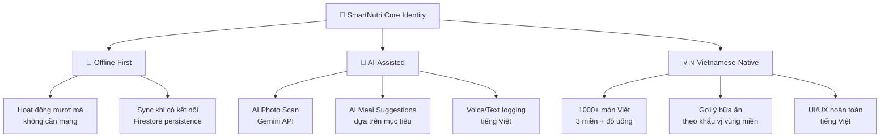

# SmartNutri — Phân Tích Cạnh Tranh & Chiến Lược Phát Triển

## 1. Bối cảnh thị trường

Thị trường app theo dõi dinh dưỡng năm 2025-2026 đang phân hóa mạnh thành hai nhóm:

| Nhóm | Đặc trưng | Đại diện |
|---|---|---|
| **"Calculators"** — Công cụ ghi chép | Database lớn, manual logging | MyFitnessPal, FatSecret, Cronometer |
| **"Executors"** — Nền tảng tự động | AI logging, meal planning, coaching | Wao, Eatsy, YAZIO |

**Xu hướng chính:**
- AI Multimodal Logging (ảnh, giọng nói, text) → giảm ma sát khi ghi chép
- Database xác minh (dietitian-verified) thay vì crowdsourced
- Tích hợp wearable (Apple Health, Google Fit, CGM)
- Coaching AI cá nhân hóa theo dữ liệu sinh học

---

## 2. So sánh chi tiết với đối thủ

### 🇻🇳 Đối thủ Việt Nam

#### **Wao** — Đối thủ trực tiếp lớn nhất
- 📊 **Database:** 20.000+ món Việt (bao gồm chuỗi đồ uống: Highlands, Phúc Long, Cộng)
- 🤖 **AI:** Scan ảnh món ăn, nhận diện công thức, ghi nhật ký bằng giọng nói
- 📱 **Tích hợp:** Apple Health, Google Fit, Health Connect
- 👥 **Cộng đồng:** Forum kết nối, hỗ trợ chuyên gia dinh dưỡng
- 🏆 **Thành tựu:** Top 20 Hàng Việt tốt 2025
- ⚡ **Thế mạnh:** Database phong phú nhất VN, AI scan tiên tiến, UX tốt

#### **Eatsy** — Đối thủ phổ biến
- 📊 **Database:** Món ăn 3 miền Việt Nam + quốc tế
- 🤖 **AI:** Food Scan AI (camera)
- 📋 **Nội dung:** 50+ thực đơn (Eat Clean, Keto, Low-Carb), bài học dinh dưỡng
- 📈 **Metrics:** BMI, BMR, TDEE, calorie deficit calculator
- 🎨 **UX:** Giao diện màu sắc, hệ thống color-coded (đỏ/cam/xanh)
- ⚡ **Thế mạnh:** Nội dung giáo dục phong phú, meal plans đa dạng

#### **DietNote** — Đối thủ offline
- 📊 **Database:** Món Việt phổ biến + Glycemic Index (GI) cho quản lý tiểu đường
- 🔌 **Offline:** 100% offline, dữ liệu lưu local
- 📋 **Nội dung:** 20+ gợi ý bữa ăn theo mục tiêu
- 📈 **Metrics:** BMR, TDEE, color-coded progress bar
- ⚡ **Thế mạnh:** Hoạt động không cần mạng, hỗ trợ bệnh nhân tiểu đường

### 🌍 Đối thủ Quốc tế

#### **MyFitnessPal**
- 📊 **Database:** 14 triệu+ (crowdsourced, nhiều sai sót)
- 🔒 **Paywall:** Barcode scanner bị khóa sau paywall
- 💰 **Monetization:** Quảng cáo nặng ở bản free
- ⚡ **Thế mạnh:** Database khổng lồ, brand awareness

#### **Cronometer**
- 📊 **Database:** 1.2 triệu (USDA/NCCDB verified)
- 🔬 **Micronutrients:** 80+ chất dinh dưỡng vi lượng
- ⚡ **Thế mạnh:** Độ chính xác cao nhất, cho athlete/biohacker

#### **FatSecret**
- 💰 **Free tier:** Barcode scanner + macro tracking + cộng đồng miễn phí
- 👥 **Social:** Forum, challenges, peer accountability
- ⚡ **Thế mạnh:** Miễn phí thực sự, cộng đồng mạnh

---

## 3. Ma trận tính năng — SmartNutri vs Đối thủ

| Tính năng | SmartNutri | Wao | Eatsy | DietNote | MFP | Cronometer | FatSecret |
|---|:---:|:---:|:---:|:---:|:---:|:---:|:---:|
| **Database món Việt** | 120 | 20.000+ | ✅ lớn | ✅ vừa | ❌ ít | ❌ | ❌ |
| **Calorie/Macro tracking** | ✅ | ✅ | ✅ | ✅ | ✅ | ✅ | ✅ |
| **TDEE/BMR calculator** | ✅ | ✅ | ✅ | ✅ | ❌ | ✅ | ❌ |
| **Water tracking** | ✅ | ✅ | ❌ | ✅ | ✅ | ✅ | Premium |
| **Weight tracking** | ✅ | ✅ | ✅ | ❌ | ✅ | ✅ | ✅ |
| **Meal type split** | ✅ 4 loại | ✅ | ✅ | ✅ 4 loại | ✅ | ✅ | ✅ |
| **Streak/Gamification** | ✅ | ✅ | ❌ | ❌ | ✅ | ❌ | ❌ |
| **Dark mode** | ✅ | ✅ | ❌ | ❌ | ✅ | ✅ | ❌ |
| **Offline support** | ✅ | ❌ | ❌ | ✅ 100% | ❌ | ❌ | ❌ |
| **Notifications/Reminders** | ✅ | ✅ | ✅ | ❌ | ✅ | ❌ | ❌ |
| **AI Photo Scan** | ❌ | ✅ | ✅ | ❌ | ❌ | ❌ | ❌ |
| **Voice logging** | ❌ | ✅ | ❌ | ❌ | ❌ | ❌ | ❌ |
| **Barcode scanner** | ❌ | ✅ | ❌ | ❌ | Premium | ✅ | ✅ |
| **Meal plans/Recipes** | ❌ | ✅ | ✅ 50+ | ✅ 20+ | Premium | ❌ | Premium |
| **Micronutrients** | ❌ | ❌ | ❌ | GI only | ❌ | ✅ 80+ | ❌ |
| **Wearable sync** | ❌ | ✅ | ❌ | ❌ | ✅ | ✅ | ✅ |
| **Community/Social** | ❌ | ✅ | ❌ | ❌ | ✅ | ❌ | ✅ |
| **Educational content** | ❌ | ❌ | ✅ | ❌ | ❌ | ❌ | ❌ |
| **Glycemic Index** | ❌ | ❌ | ❌ | ✅ | ❌ | ❌ | ❌ |
| **Admin web panel** | ✅ scaffold | ❌ | ❌ | ❌ | ❌ | ❌ | ❌ |

---

## 4. Phân tích GAP — Điểm mạnh & Điểm yếu SmartNutri

### ✅ Thế mạnh hiện tại (giữ & phát huy)
1. **Offline-first architecture** — Firestore persistence + unlimited cache. Đây là lợi thế lớn so với Wao/Eatsy (cần mạng), chỉ DietNote có offline nhưng 100% local (không sync).
2. **Open-source codebase** — Không phụ thuộc vendor, toàn quyền kiểm soát.
3. **Admin web panel** — Không đối thủ VN nào có panel quản trị riêng cho backend.
4. **Dark mode** — Eatsy và DietNote không có.
5. **Clean architecture** — Feature-based modular structure, dễ scale.
6. **TDEE tính tự động** từ profile, không cần user nhập manual.
7. **7-day statistics & streak** — Gamification cơ bản đã có.

### ❌ Điểm yếu cần khắc phục ngay

| Gap | Mức độ | Giải thích |
|---|---|---|
| **Database quá nhỏ (120 món)** | 🔴 Critical | Wao có 20.000+, thậm chí DietNote cũng nhiều hơn. Đây là rào cản lớn nhất. |
| **Không có AI scan** | 🔴 Critical | Photo scan đã là "table stakes" năm 2026. Wao & Eatsy đều có. |
| **Không có barcode scanner** | 🟡 High | Đồ đóng gói chiếm tỷ trọng lớn ở siêu thị VN. |
| **Không có meal plans/recipes** | 🟡 High | Eatsy có 50+ thực đơn, DietNote có 20+. User cần được gợi ý "ăn gì". |
| **Không có wearable sync** | 🟡 High | Apple Health/Google Fit integration là kỳ vọng cơ bản. |
| **Không có cộng đồng** | 🟢 Medium | Wao & FatSecret có, nhưng đây không phải core differentiator. |
| **Không có educational content** | 🟢 Medium | Eatsy nổi bật ở mảng này, nhưng không bắt buộc cho MVP. |

---

## 5. Tầm nhìn & Định vị mới cho SmartNutri

### Tuyên bố định vị (Positioning Statement)

> **SmartNutri** là ứng dụng theo dõi dinh dưỡng **thông minh, nhanh, và hoạt động offline** dành cho người Việt. Kết hợp **AI ghi chép tự động** với **database món Việt chuyên sâu** và **offline-first architecture**, SmartNutri giúp bạn hiểu và cải thiện chế độ ăn uống mà không cần mạng, không cần phức tạp.

### Chiến lược cạnh tranh: "Smart + Offline + Vietnamese"

Thay vì cạnh tranh trực diện với Wao (20K món, AI mạnh, đội ngũ lớn), SmartNutri nên tập trung vào 3 trụ cột khác biệt:



### Đối tượng mục tiêu (Target Users)

| Persona | Mô tả | Nhu cầu chính |
|---|---|---|
| **Người giảm cân** | 20-35 tuổi, muốn kiểm soát calo | Tracking nhanh, meal plans, calorie deficit |
| **Người tập gym** | Cần theo dõi macro (protein/carb/fat) | Macro tracking chính xác, meal prep |
| **Người bận rộn** | Ít thời gian, thường ở nơi mạng yếu | Offline tracking, AI scan nhanh |
| **Bệnh nhân (tiểu đường, tim mạch)** | Cần kiểm soát dinh dưỡng đặc biệt | GI tracking, micronutrients, báo cáo chi tiết |

---

## 6. Roadmap phát triển — 4 Giai đoạn

### Phase 1: 🔧 Foundation Polish (2–3 tuần)
> **Mục tiêu:** Hoàn thiện MVP, fix critical gaps nhỏ nhất

- [ ] **Mở rộng database lên 500+ món** (3 miền + đồ uống phổ biến + đồ ăn nhanh)
  - Phân loại: Miền Bắc / Miền Trung / Miền Nam / Đồ uống / Ăn vặt / Fastfood
  - Thêm data cho chuỗi phổ biến (Highlands, Phúc Long, KFC, McDonald's VN...)
- [ ] **Migrate food catalog → Firestore** `foods` collection (admin quản lý)
- [ ] **Hoàn thiện Admin Web CRUD** (thêm/sửa/xóa foods, xem user stats)
- [ ] **Thêm Sign-In with Google** (Firebase Auth provider)
- [ ] **Thêm Sign-In with Apple** (yêu cầu bắt buộc trên App Store)
- [ ] **Fix: Calorie ring animation** mượt hơn, thêm haptic feedback
- [ ] **Fix: Weekly summary** — thêm so sánh tuần trước vs tuần này

### Phase 2: 🤖 AI & Smart Features (3–4 tuần)
> **Mục tiêu:** Triển khai AI — điểm đột phá so với DietNote, ngang hàng Wao/Eatsy

- [ ] **AI Photo Scan** — Dùng Gemini API (Cloud Functions) để nhận diện món ăn từ ảnh
  - User chụp ảnh → gửi lên Cloud Function → Gemini Vision phân tích → trả về tên món + calo ước tính
  - Fallback: Nếu AI không nhận diện được, chuyển sang manual search
- [ ] **AI Meal Suggestions** — Gợi ý "ăn gì hôm nay" dựa trên:
  - Calo còn lại trong ngày
  - Macro target chưa đạt
  - Lịch sử ăn uống (tránh lặp)
  - Preferences từ profile (vegetarian, keto...)
- [ ] **Barcode Scanner** — Tích hợp camera scan mã vạch sản phẩm đóng gói
  - Tra cứu từ database hoặc OpenFoodFacts API
- [ ] **Quick-add từ Recent Foods** — Cải thiện flow "ghi nhanh" bữa ăn thường xuyên

### Phase 3: 📊 Health Platform (3–4 tuần)
> **Mục tiêu:** Trở thành nền tảng sức khỏe toàn diện, không chỉ calorie counter

- [ ] **Apple Health / Google Fit sync** — Đồng bộ bước chân, calories burned, cân nặng
- [ ] **Meal Plans & Recipes** — Thực đơn mẫu theo mục tiêu:
  - Giảm cân (calorie deficit), Tăng cơ (high protein), Eat Clean, Keto, Tiểu đường (low GI)
  - Mỗi plan có 7 ngày, tự động tính calo/macro
- [ ] **Micronutrient tracking** — Mở rộng từ macro (P/C/F) sang vitamin, khoáng chất, chất xơ
- [ ] **Glycemic Index (GI)** — Thêm GI vào FoodItem model, hữu ích cho bệnh nhân tiểu đường
- [ ] **Monthly/Yearly Reports** — Báo cáo dài hạn (xu hướng cân nặng, adherence rate, streak history)
- [ ] **Export PDF/CSV** — Xuất báo cáo cho bác sĩ/PT

### Phase 4: 🚀 Growth & Community (4+ tuần)
> **Mục tiêu:** Tăng trưởng người dùng, xây dựng hệ sinh thái

- [ ] **Cộng đồng trong app** — Feed chia sẻ bữa ăn, challenge, leaderboard
- [ ] **AI Voice Logging** — Ghi nhật ký bằng giọng nói tiếng Việt (speech-to-text → AI parse)
- [ ] **Educational Content** — Bài viết/video ngắn về dinh dưỡng, tips nấu ăn healthy
- [ ] **Push Notifications thông minh** — AI phân tích pattern → nhắc nhở cá nhân hóa
- [ ] **Premium tier** — Monetization model:
  - Free: Tracking cơ bản, 500+ foods, 7-day stats
  - Premium: AI scan, meal plans, micronutrients, wearable sync, reports
- [ ] **Multi-language** — Thêm English cho expat/tourist tại Việt Nam
- [ ] **Production release** — App Store + Google Play + CI/CD pipeline

---

## 7. Ưu tiên kỹ thuật theo Phase

### Phase 1 — Cần làm ngay trong codebase

```
1. food_service.dart     → Refactor: tách hard-coded data → Firestore migration script
2. admin-web/            → Build CRUD: foods collection (add/edit/delete/import CSV)
3. auth_service.dart     → Thêm Google Sign-In + Apple Sign-In providers
4. firestore.rules       → Thêm rules cho admin role (custom claims)
5. food_service.dart     → Mở rộng FoodItem: thêm fields region, brand, tags
6. FoodItem model        → Thêm: imageUrl, region, tags[], verified (bool)
```

### Phase 2 — Kiến trúc AI

```
1. functions/src/        → Thêm Cloud Function: analyzeFoodPhoto (Gemini Vision API)
2. functions/src/        → Thêm Cloud Function: suggestMeals (dựa trên daily intake)
3. lib/src/features/     → Thêm feature module: ai_scan/ (camera + API call + result UI)
4. lib/src/core/services → Thêm: barcode_service.dart (camera_barcode_scanner package)
5. pubspec.yaml          → Thêm: camera, image_picker, mobile_scanner packages
```

### Phase 3 — Health Platform

```
1. pubspec.yaml          → Thêm: health package (Apple Health / Google Fit)
2. FoodItem model        → Thêm: fiber, sugar, sodium, glycemicIndex, vitamins map
3. features/meal_plan/   → New feature module: domain + presentation
4. features/reports/     → New feature module: monthly/yearly charts
5. core/services/        → Thêm: health_sync_service.dart, meal_plan_service.dart
```

---

## 8. KPIs đề xuất

| Metric | Phase 1 Target | Phase 4 Target |
|---|---|---|
| Số món trong database | 500+ | 5.000+ |
| Daily Active Users | - | 1.000+ |
| Retention (7-day) | - | > 40% |
| Meals logged / user / day | 2+ | 3+ |
| AI scan accuracy | - | > 85% |
| App Store rating | - | > 4.5 ⭐ |
| Time to log 1 meal | < 30s (manual) | < 5s (AI scan) |

---

## 9. Tóm tắt

> [!IMPORTANT]
> **SmartNutri có nền tảng kỹ thuật tốt** (clean architecture, offline-first, dark mode, auth flow hoàn chỉnh) nhưng đang **thiếu 2 thứ quan trọng nhất** để cạnh tranh:
> 1. **Database đủ lớn** (120 món vs 20.000+ của Wao)
> 2. **AI-powered logging** (photo scan đã là tiêu chuẩn bắt buộc năm 2026)
>
> **Hành động ưu tiên cao nhất:** Mở rộng database → Migrate lên Firestore → Xây AI Photo Scan.
